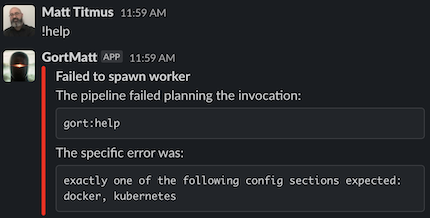
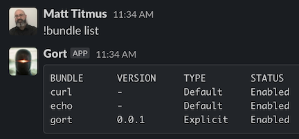

# Gort

[](https://godoc.org/github.com/getgort/gort)
[](https://github.com/getgort/gort/actions/workflows/test.yaml)
[](https://goreportcard.com/report/github.com/getgort/gort)

Gort is a chatbot framework designed from the ground up for chatops.

Gort brings the power of the command line to the place you collaborate with your team: your chat window. Its open-ended command bundle support allows developers to implement functionality in the language of their choice, while powerful access control means you can collaborate around even the most sensitive tasks with confidence. A focus on extensibility and adaptability means that you can respond quickly to the unexpected, without your team losing visibility.

The official documentation can be found here: [The Gort Guide](https://guide.getgort.io/).

## History

Gort was initially conceived of as a Go re-implementation of Operable's [Cog](https://github.com/operable/cog), and while it remains heavily inspired by Cog, Gort has largely gone its own way.

During our initial [design discussion](https://docs.google.com/document/d/1u7LzEzPjT1L8_xkHL577cKeuQdCiCQAww8M0rx1QXEM/edit), we found that many of Cog’s features, however innovative, went largely unused, and the codebase had become difficult to extend and maintain. Additionally, its implementation language -- Elixir -- had relatively few proficient developers. The solution, which was discussed for many months on the Cog Slack workspace, was to rewrite Cog from scratch in Go, removing some of less-used functionality and reducing complexity in the process.

This gave us the opportunity to consider and possibly redefine what Cog was meant to be. To choose the features that make sense, and to discard those that don't. In this way, Gort can be described more as a “spiritual successor” to Cog than a faithful re-implementation.

## Features

Gort's design philosophy emphasizes flexibility and security by allowing you to build commands in any language you want, using tooling you're already comfortable with, and can tightly control who can use them and how.

More specifically:

- Commands can be implemented in any programming language
- Users may trigger commands through Slack (or another chat provider)
- Commands are packaged into bundles that can be installed in Gort
- Users can be assigned to groups, roles can be assigned to groups, and permissions can be attached to roles
- Supports a sophisticated identity and permission system to determine who can use commands
- System and command output is highly customizable at the application, bundle, and even command level
- Supports Slack and Discord as first class chat providers (with more on the way!)
- All command and API activities are stored in a dedicated audit log for review

Each of these is described in more detail below.

### Users may trigger commands through Slack (or another chat provider)

Users primarily interact with Gort through _commands_, which are triggered by a command character (`!` by default) but are otherwise conceptually identical to commands entered on the command line.

For example, using an `echo` command might look like the following:


As shown, the output from successful commands is relayed back by Gort.

More information about commands can be found in the Gort Guide:

* [Gort Guide: Commands and Bundles](https://guide.getgort.io/en/latest/sections/commands-and-bundles.html)
### Commands can be implemented in any programming language

Gort [commands](https://guide.getgort.io/en/latest/sections/commands-and-bundles.html) are built as container images, which means you can build them in any language you're comfortable with.

What's more, because your executable receives all chat inputs exactly as if it was being typed on the command line, you can use any command line interpreter you want. Commands can even be implemented as Bash scripts, or using existing commands, like `curl`!

More information about writing commands can be found in the Gort Guide:

* [Gort Guide: Writing a Command Bundle](https://guide.getgort.io/en/latest/sections/writing-a-command-bundle.html)

### Commands are packaged into bundles that can be installed in Gort

In Gort, a set of one or more related commands can be installed as a "command bundle".

A bundle is [represented in YAML](https://guide.getgort.io/en/latest/sections/bundle-configurations.html), specifying which executable to use for each command and who is allowed to execute each commands.

A very simple bundle file is shown below.

```yaml
---
gort_bundle_version: 1

name: echo
version: 0.0.1
image: ubuntu:20.04

author: Matt Titmus <matthew.titmus@gmail.com>
homepage: https://guide.getgort.io
description: A test bundle.
long_description: |-
  This is an example bundle. It lets you echo text using the "echo"
  command that's built into Ubuntu 20.04.

permissions:
  - can_echo

commands:
  echo:
    description: "Echos back anything sent to it."
    executable: [ "/bin/echo" ]
    rules:
      - must have echo:can_echo
```

This shows a bundle called `echo`, which defines a command (also called `echo`) and a permission called `can_echo`. Once [installed](https://guide.getgort.io/en/latest/sections/managing-bundles.html), any user with the `echo:can_echo` permission can execute it in Slack.

More information about bundles can be found in the Gort Guide:

* [Gort Guide: Bundle Configurations](https://guide.getgort.io/en/latest/sections/bundle-configurations.html)
* [Gort Guide: Managing Bundles](https://guide.getgort.io/en/latest/sections/managing-bundles.html)

### Organize users into groups, and permissions into roles

In Gort, _users_ can be uniquely mapped to users in one or more chat providers. Gort users can be members of one or more _groups_, which in turn can have any number of _roles_ that can be thought of as collections of granted permissions. For example, the user `dave` might be in a group called `developers`. This group may have a role attached named `deployers` that contains a number of permissions, including one called `production_deploy`.

More information about permissions and rules can be found in the Gort Guide:

* [Gort Guide: Managing Users](https://guide.getgort.io/en/latest/sections/managing-users.html)

### Use a sophisticated identity and permission system to determine who can use commands

A sophisticated rule system can be applied for each command defining who can use it. These can be quite granular, and are even capable of making permissions decisions based on the values of specific flags or parameters.

Rules are assigned at the bundle level, and can be quite sophisticated. Below we have a subset of a bundle called `deploy`.

```yaml
name: deploy
version: 0.0.1

permissions:
  - production_deploy

commands:
  deploy:
    description: "Deploys to the chosen environment."
    executable: [ "/bin/deploy" ]
    rules:
      - with arg[0] == "production" must have deploy:production_deploy
```

As you can see, the above example includes one command, also called `deploy`. Its one rule asserts that any user passing "production" as the parameter must have the `production_deploy` permission (from the `deploy` bundle).

More information about permissions and rules can be found in the Gort Guide:

* [Gort Guide: Permissions and Rules](https://guide.getgort.io/en/latest/sections/permissions-and-rules.html)
* [Gort Guide: Command Execution Rules](https://guide.getgort.io/en/latest/sections/command-execution-rules.html)

### System and command output is highly customizable

Gort provides a sophisticated templating system that allows you to control the presentation of any information sent to users, including system messages, as well as command output and error messages.

What's more, templates can be defined at the application level in the [configuration](https://guide.getgort.io/en/latest/sections/configuration.html), or at the bundle or even the command level in individual [bundle configurations](https://guide.getgort.io/en/latest/sections/bundle-configurations.html).

Gort templates use Go's [template syntax](https://pkg.go.dev/text/template) to format output in a chat-agnostic way. For example, a very simple _command template_ might look something like the following:

```
{{ text | monospace true }}{{ .Response.Out }}{{ endtext }}
```

This template emits the command's response (`.Response.Out`) as monospaced text, which may look something like the following:


A slightly more complicated template, this one a _command error template_ (actually the default), is shown below.

```
{{ header | color "#FF0000" | title .Response.Title }}
{{ text }}The pipeline failed planning the invocation:{{ endtext }}
{{ text | monospace true }}{{ .Request.Bundle.Name }}:{{ .Request.Command.Name }} {{ .Request.Parameters }}{{ endtext }}
{{ text }}The specific error was:{{ endtext }}
{{ text | monospace true }}{{ .Response.Out }}{{ endtext }}
```

This one includes a header with a color and title, as well as some alternating monospaced and standard text. In this case, this will format a command error something like the following:



You'll notice some references to `.Response`: those are references to the [_response envelope_](https://guide.getgort.io/templates-response-envelope.html), a data structure that's accessible from any template that makes available all of the data and metadata around one command request, execution, and response.

More information about audit logging can be found in the Gort Guide:

* [Gort Guide: Output Format Templates](https://guide.getgort.io/en/latest/sections/templates.html)
* [Gort Guide: The Response Envelope](https://guide.getgort.io/en/latest/sections/templates-response-envelope.html)
* [Gort Guide: Template Functions](https://guide.getgort.io/en/latest/sections/templates-functions.html)

### Supports Slack and Discord as first class chat providers

Gort supports both [Slack](https://slack.com/) and [Discord](https://discord.com/) as first class chat providers.

Each supported chat provider has a dedicated section [in the configuration](https://guide.getgort.io/en/latest/sections/configuration.html). Note that each of these is a list, so not only can you interact with both Slack and Discord from the same Gort controller, but you can interact with multiple instances of each if you want to!

Once you've created a bot user according to the instructions provided in [Gort Quick Start](https://guide.getgort.io/en/latest/sections/quickstart.html), an administrators need only to create a Gort user (if you haven't already), and map that Gort user to a chat provider user ID, as shown below:

```bash
$ gort user create mtitmus --email matthew.titmus@gmail.com --name "Matt Titmus" --password REDACTED
User "mtitmus" created.

$ gort user list
USER NAME   FULL NAME            EMAIL
admin       Gort Administrator   gort@localhost
mtitmus     Matt Titmus          matthew.titmus@gmail.com

$ gort user map mtitmus Slack U012P123456
User "mtitmus" mapped to "Slack:U012P123456".

$ gort user info mtitmus
Name       mtitmus
Full Name  Matt Titmus
Email      matthew.titmus@gmail.com
Groups     <undefined>

ADAPTER   ID MAPPING
Slack     U012P123456
```

From then on any commands entered by the mapped chat user are associated with that Gort user!

* [Gort Guide: Quick Start](https://guide.getgort.io/en/latest/sections/quickstart.html)

### Records all command and API activities in an audit log

All command activities are both emitted as high-cardinality log events (shown below) and recorded in [an audit log](https://guide.getgort.io/en/latest/sections/audit-log-events.html) that's maintained in Gort's database.

Take, for example, a user executing the `!bundle list` command from Slack:



This will generate log output similar to the following:

```
INFO   [49594] Triggering command   adapter.name=Gort bundle.default=false bundle.name=gort bundle.version=0.0.1
                                    command.executable="[/bin/gort bundle]" command.name=bundle
                                    command.params=list gort.user.name=admin provider.channel.id=C1238A01234
                                    provider.channel.name=gort-dev provider.user.email=matthew.titmus@gmail.com
                                    provider.user.id=U012P123456 trace.id=476b3089c8ce0d38a2915a3b58fde032
```

As you can see, this rich event includes:

* The chat provider ("Gort", as named in the configuration), and channel within it
* The triggered bundle (and its version) and command (and executable), and the parameters passed to it
* The name of the user (both the Gort user ID and Slack user ID)
* A unique trace ID that's used by all log events associated with this invocation.

Note that this example uses "human readable" format for readability. In production mode Gort generates JSON-encoded log events.

More information about audit logging can be found in the Gort Guide:

* [Gort Guide: Audit Log Events](https://guide.getgort.io/en/latest/sections/audit-log-events.html)

<!-- - execute triggered commands anywhere a relay is installed using a tag-based targeting system, -->

<!-- ## Gort Design

A WIP design doc, including rough milestones (but not dates) [can be seen here](https://docs.google.com/document/d/1u7LzEzPjT1L8_xkHL577cKeuQdCiCQAww8M0rx1QXEM/edit?usp=sharing). Feel free to add questions or comments. -->

## How to Run the Gort Controller

For more information, take a look at the [Quick Start Guide](https://guide.getgort.io/en/latest/sections/quickstart.html) in [The Gort Guide](https://guide.getgort.io).

## The Gort Client

The `gort` binary also serves as the controller administration CLI.

### Configuring Client Profiles

The `gort` client uses a YAML-formatted configuration file, conventionally
located in the `profile` file in a `.gort` directory in your home directory.
This is where you can store connection credentials to allow `gort` to interact
with the Gort's Controller's REST API.

An example `.gort/profile` file might look like this:

```yaml
defaults:
    profile: gort

gort:
    url: https://gort.mycompany.com:4000
    password: "seekrit#password"
    user: me

preprod:
    url: https://gort.preprod.mycompany.com:4000
    password: "anotherseekrit#password"
    user: me
```

Comments begin with a `#` character; if your password contains a `#`,
surround the entire password in quotes, as illustrated above.

You can store multiple "profiles" in this file, with a different name
for each (here, we have `gort` and `preprod`). Whichever one is noted
as the default (in the `defaults` section) will be used by
`gort`. However, you can pass the `--profile=$PROFILE` option to
`gort` to use a different set of credentials.

While you can add profiles to this file manually, you can also use the
`gort profile create` command to help.

### Getting Help

The `gort` executable contains a number of commands and sub-commands.
Help is available for all of them by passing the `--help` option.
Start with `gort --help`, and go from there.

## Status of This Project

Gort is in a state of active heavy development. The date that various milestones have been achieved are listed below. The number and focus of present and future milestones are subject to change.

- Project created: 27 December 2018
- Milestone 1: [7 January 2019](https://github.com/getgort/gort/tree/v0.1.0-dev.0)
- Milestone 2: [21 January 2019](https://github.com/getgort/gort/tree/v0.2.1-dev.0)
- Milestone 3: [24 January 2019](https://github.com/getgort/gort/tree/v0.3.0-dev.0)
- Milestone 4: [17 March 2019](https://github.com/getgort/gort/releases/tag/v0.4.6-dev.7)
- Milestone 5: [7 June 2021](https://github.com/getgort/gort/releases/tag/v0.5.6-dev.0)
- Milestone 6: [10 June 2021](https://github.com/getgort/gort/releases/tag/v0.6.0-dev.0)
- Milestone 7: [15 June 2021](https://github.com/getgort/gort/releases/tag/v0.7.0-dev.0)
- Milestone 8: [26 July 2021](https://github.com/getgort/gort/releases/tag/v0.8.0) (alpha: [2 July 2021](https://github.com/getgort/gort/releases/tag/v0.8.0-alpha.0); beta: [15 July 2021](https://github.com/getgort/gort/releases/tag/v0.8.0-beta.0))
- Milestone 9: [19 November 2021](https://github.com/getgort/gort/releases/tag/v0.9.0)

## More Links

* [Gort Slack Community](https://join.slack.com/t/getgort/shared_invite/zt-z1elsl5i-XvkiBPHqUOTDUUH1j9dSbg)
* [GitHub Issues](https://github.com/getgort/gort/issues)
